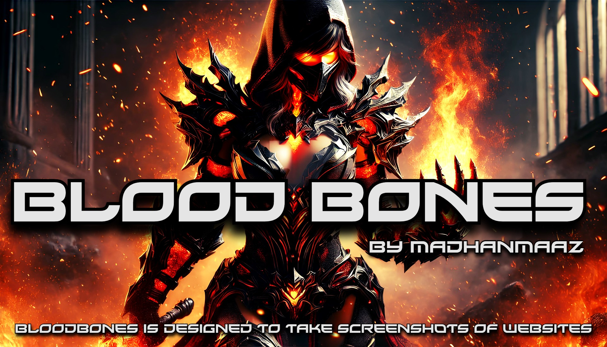

<h1 align="center">BloodBones</h1>
<p align="center">
  <strong>A versatile tool designed to take screenshots of webpages efficiently.</strong>
</p>


## 🌟 Features

- **Multiple Input Options** : Accept URLs or files containing lists of targets.
- **Highly Configurable** : Adjust browser settings, image quality, and more.
- **Proxy Support** : Route traffic through custom proxy servers.
- **Mobile Simulation** : Simulate mobile devices and take screenshots.
- **Custom Viewports** : Specify viewport dimensions and orientations.
- **Log Management** : Save detailed logs of the execution process.

## 🚀 Demo
https://github.com/user-attachments/assets/9cfa492b-0ebd-49f6-851b-78791c0dde78

## 🛠️ Installation

### Prerequisites
- Node.js (v18 or later)
- npm

### Steps
1. Clone the repository:
```bash
git clone https://github.com/madhanmaaz/bloodbones.git
cd bloodbones
```
2. Install dependencies:
```bash
npm install
```

## 📋 Usage
### Basic Syntax
```bash
node index.js [options]
```

### Examples
- Take a screenshot of specific URLs:
```bash
node index.js --url https://example.com https://example2.com
```

- Take a screenshot of URLs listed in a file:
```bash
node index.js --file ./urls.txt
```

## ⚙️ Options
### Input Options:
- `--url, -u` (array): Specify target URLs.
- `--file, -f` (string): Specify a file containing target URLs.

### Settings:
- `--threads, -t` (number): Number of concurrent tasks (default: 1).
- `--proxy` (string): Proxy server (e.g., http://127.0.0.1:8080).
- `--log-file` (string): Path to save log files.
- `--resolve` (boolean): Resolve IP/hostname for targets (default: false).
- `--delay` (number): Delay before taking screenshots (default: 0.2 seconds).
- `--timeout` (number): Navigation timeout (default: 20 seconds).
- `--open` (boolean): Open the report in a browser (default: false).

### Browser Options:
- `--browser` (string): Specify browser to use (default: chromium).
- `--headless` (boolean): Run the browser in headless mode (default: true).
- `--img-format` (string): Format for screenshots (e.g., jpeg, png).
- `--img-quality` (number): Quality of screenshots (1-100, default: 90).
- `--mobile` (boolean): Simulate a mobile device viewport (default: false).
- `--landscape` (boolean): Take screenshots in landscape orientation (default: true).
- `--viewport` (string): Viewport dimensions (e.g., 1920x1080, default: 1920x1080).
- `--useragent` (string): Set a custom user agent for the browser.

### General Options:
- `--help, -h`: Show help menu.
- `--version`: Display the current version of BloodBones.

## 📝 License
This project is licensed under the MIT License. 

## 🤝 Contributing
Contributions are welcome! Feel free to submit issues or pull requests to help improve BloodBones.

## 📧 Contact
- For any questions or feedback, feel free to contact the developer at https://madhanmaaz.netlify.app.